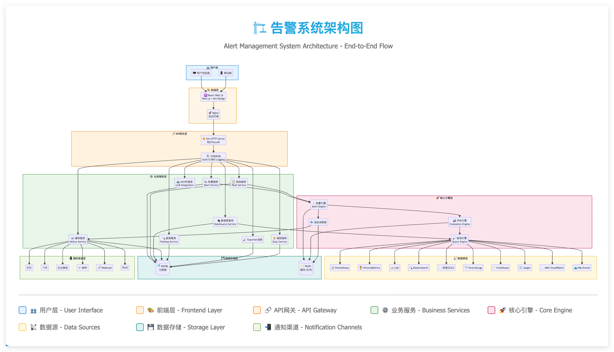
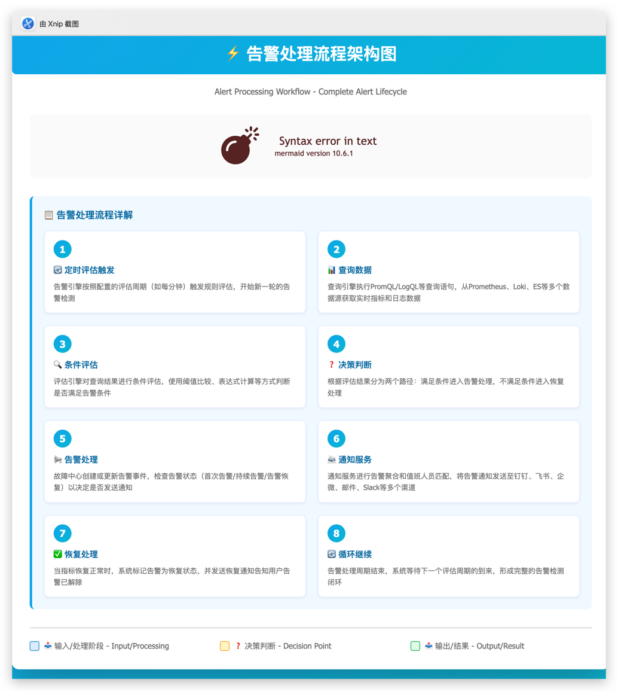

# AlertHub

<div align="center">

[](https://goreportcard.com/report/github.com/daihao4371/AlertHub)
[](LICENSE)
[](https://github.com/daihao4371/AlertHub/releases)
[](https://registry.cn-hangzhou.aliyuncs.com/devops-dh/alerthub)

**云原生环境下的轻量级智能监控告警引擎**

*专注可观测性与稳定性，通过 AI 智能分析提升故障响应效率*

[快速开始](#-快速开始) • [功能特性](#-功能特性) • [部署指南](#-部署指南) • [文档](#-文档) • [贡献指南](#-贡献指南)

</div>

## 🚀 快速开始

**5 分钟部署体验**

```bash
# 克隆项目
git clone https://github.com/daihao4371/AlertHub.git
cd AlertHub

# Helm 一键部署（包含 MySQL + Redis + AlertHub）
cd deploy/helmchart
helm install alerthub . -n monitoring --create-namespace

# 访问服务
kubectl port-forward -n monitoring svc/alerthub-web 3000:3000
```

访问 `http://localhost:3000` 开始使用 AlertHub

## ✨ 功能特性

### 🧠 AI 智能分析
- **智能根因分析**：自动解析告警内容，识别异常模式
- **修复建议生成**：基于历史数据提供排查思路和修复方案
- **异常趋势预测**：提前发现潜在问题，预防故障发生

### 🔄 全链路监控
- **多数据源支持**：Prometheus、Loki、Jaeger、ElasticSearch 等
- **统一告警管理**：Metrics、Logs、Traces、Events 四位一体
- **实时拨测监控**：HTTP、TCP、SSL、ICMP 网络健康检查

### 🎯 精准告警
- **智能降噪**：减少告警风暴，提高信噪比
- **分级升级**：多级告警策略，确保关键问题不遗漏
- **值班轮换**：自动匹配责任人，支持节假日调整

### 📊 可视化分析
- **实时仪表盘**：直观展示系统健康状态
- **故障中心**：集中管理故障生命周期
- **审计日志**：完整的操作记录追溯

## 🛠 系统架构

AlertHub 采用云原生微服务架构，通过分层设计实现高可扩展性和可维护性。



### 架构层次

```
┌─────────────────┐
│   用户界面层      │  Web UI (AlertHub-web)、移动端界面
├─────────────────┤
│   API 网关层     │  统一接入、认证授权、流量控制
├─────────────────┤
│   业务服务层      │  告警服务、规则引擎、数据处理
├─────────────────┤
│   核心引擎层      │  告警引擎、推送引擎、AI分析
├─────────────────┤
│   数据接入层      │  多数据源适配器、数据标准化
├─────────────────┤
│   存储服务层      │  时序数据库、关系数据库、缓存
└─────────────────┘
```

## ⚡ 告警处理流程

AlertHub 提供完整的告警生命周期管理，从触发到恢复的全流程自动化处理。



### 处理流程说明

1. **定时评估触发** → 告警引擎按配置周期进行监测评估
2. **查询数据** → 执行 PromQL/LogQL 查询，从多数据源获取监控数据
3. **条件评估** → 使用阈值比较、表达式计算判断是否满足告警条件
4. **决策判断** → 满足条件进入告警处理，否则继续监控循环
5. **告警处理** → 故障中心创建/更新事件，管理告警状态
6. **通知服务** → 告警整合、值班匹配，多渠道通知发送
7. **恢复处理** → 指标恢复时发送恢复通知，完成告警闭环
8. **循环继续** → 等待下一评估周期，持续监控

### 数据源支持

| 类型 | 支持的数据源 |
|------|-------------|
| **Metrics** | Prometheus, VictoriaMetrics |
| **Logs** | Loki, ElasticSearch, ClickHouse, VictoriaLogs, 阿里云SLS |
| **Traces** | Jaeger |
| **Events** | Kubernetes Events |
| **Probing** | HTTP, TCP, SSL, ICMP |

### 通知渠道

- 🚀 **即时通讯**：钉钉、飞书、企业微信、Slack
- 📧 **邮件通知**：SMTP 邮件服务
- 🔗 **自定义集成**：Webhook、API 调用
- 📱 **移动端推送**：支持移动应用通知

## 📦 部署指南

### 环境要求

- **Kubernetes**: >= v1.20
- **Helm**: >= v3.0
- **Go**: >= v1.23 (开发环境)
- **Node.js**: >= v18.20 (前端开发)

### 生产部署

#### 方案一：快速体验（推荐新用户）

```bash
# 自动部署完整环境
helm repo add alerthub https://charts.alerthub.com
helm install alerthub alerthub/alerthub -n monitoring --create-namespace
```

#### 方案二：自定义部署（推荐生产环境）

```bash
# 下载配置文件
wget https://raw.githubusercontent.com/daihao4371/AlertHub/master/deploy/values-production.yaml

# 编辑配置（数据库、存储等）
vim values-production.yaml

# 部署
helm install alerthub alerthub/alerthub -n monitoring -f values-production.yaml
```

### Docker 部署

```bash
# 使用 Docker Compose
wget https://raw.githubusercontent.com/daihao4371/AlertHub/master/deploy/docker-compose/docker-compose.yaml
docker-compose up -d
```

### 验证部署

```bash
# 检查服务状态
kubectl get pods -n monitoring
kubectl get svc -n monitoring

# 访问服务
kubectl port-forward -n monitoring svc/alerthub-web 3000:3000
```

## 📚 文档

- 📖 [**完整文档**](https://docs.alerthub.com)
- 🚀 [**快速入门**](https://docs.alerthub.com/getting-started)
- 🔧 [**配置指南**](https://docs.alerthub.com/configuration)
- 🔌 [**API 文档**](https://docs.alerthub.com/api)
- 💡 [**最佳实践**](https://docs.alerthub.com/best-practices)
- ❓ [**常见问题**](https://docs.alerthub.com/faq)

## 🤝 贡献指南

我们欢迎所有形式的贡献！

### 参与方式

1. **提交问题**：[报告 Bug](https://github.com/daihao4371/AlertHub/issues/new?template=bug_report.md)
2. **功能建议**：[提出需求](https://github.com/daihao4371/AlertHub/issues/new?template=feature_request.md)
3. **代码贡献**：Fork -> 开发 -> Pull Request
4. **文档改进**：修复文档错误或添加新内容

### 开发环境

```bash
# 克隆项目
git clone https://github.com/daihao4371/AlertHub.git
cd AlertHub

# 后端开发
go mod tidy
go run main.go

# 前端开发
git clone https://github.com/daihao4371/AlertHub-web.git
cd AlertHub-web
npm install
npm start
```

### 提交规范

- feat: 新功能
- fix: 修复问题
- docs: 文档更新
- style: 代码格式
- refactor: 重构
- test: 测试相关
- chore: 构建/工具

---

<div align="center">

**如果这个项目对你有帮助，请给我们一个 ⭐ Star！**

Made with ❤️ by [AlertHub Team](https://github.com/daihao4371)

</div>

